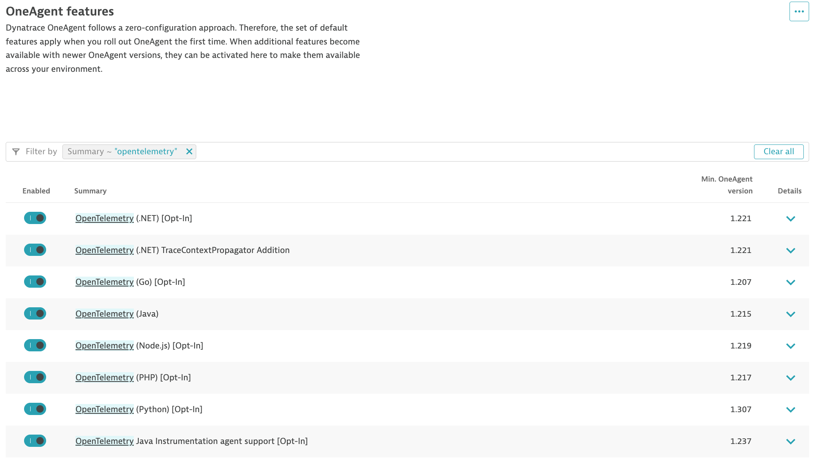

--8<-- "snippets/send-bizevent/2-getting-started.js"
--8<-- "snippets/requirements.md"

## Prerequisites

You will need full administrator access to a Dynatrace SaaS tenant with a DPS license.

* Enable OpenTelemetry OneAgent Features

### Enable OpenTelemetry OneAgent Features

The demo application in this lab, AstroShop, contains OpenTelemetry instrumentation that can be picked up by OneAgent.

Navigate to the `Settings Classic` app in the Dynatrace tenant.  Open `OneAgent Features` from the **Preferences** sub-menu.  Search for features that contain the word `OpenTelemetry`.  Enable all OneAgent features for OpenTelemetry.

## Continue

In the next section, we'll launch our Codespaces instance.

- [Continue to Codespaces:octicons-arrow-right-24:](3-codespaces.md)

