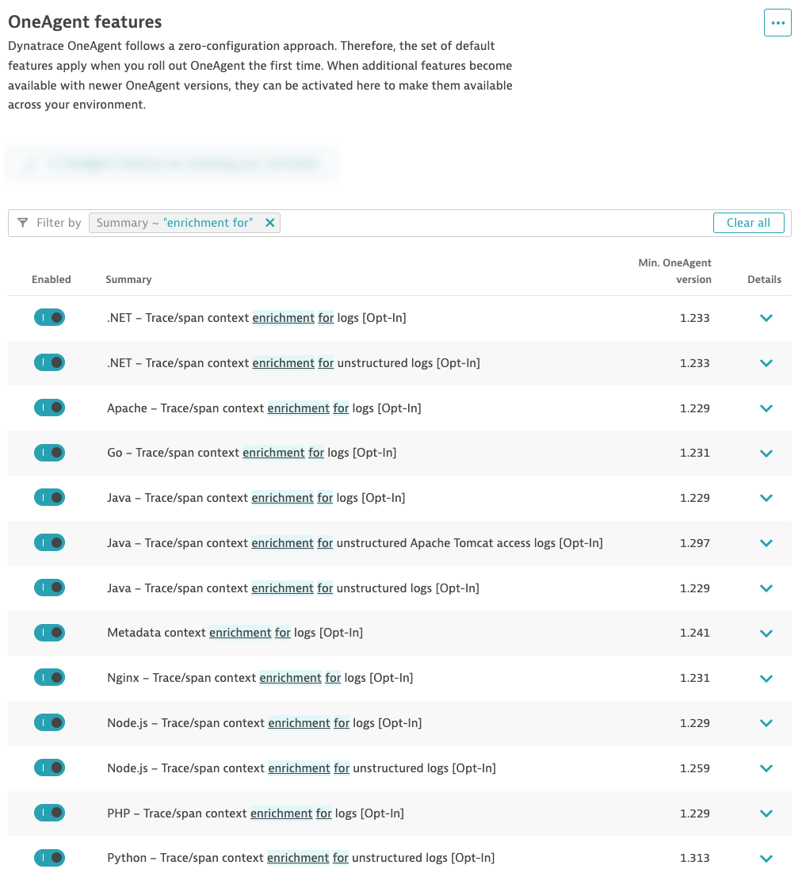

--8<-- "snippets/send-bizevent/2-getting-started.js"
--8<-- "snippets/requirements.md"

## Prerequisites

You will need full administrator access to a Dynatrace SaaS tenant with a DPS license.

* Enable OpenTelemetry OneAgent Features
* Enable Log Enrichment OneAgent Features

### Enable OpenTelemetry OneAgent Features

The demo application in this lab, AstroShop, contains OpenTelemetry instrumentation that can be picked up by OneAgent.

Navigate to the `Settings Classic` app in the Dynatrace tenant.  Open `OneAgent Features` from the **Preferences** sub-menu.  Search for features that contain the word `OpenTelemetry`.  Enable all OneAgent features for OpenTelemetry.

### Enable Log Enrichment OneAgent Features

Dynatrace can enrich your ingested log data with additional information that helps Dynatrace to recognize, correlate, and evaluate the data. Log enrichment results in a more refined analysis of your logs.  Log enrichment enables you to seamlessly switch context and analyze individual spans, transactions, or entire workloads.

Navigate to the `Settings Classic` app in the Dynatrace tenant.  Open `OneAgent Features` from the **Preferences** sub-menu.  Search for features that contain the words `enrichment for`.  Enable all OneAgent features for Log Enrichment.

!!! tip "Node.js Log Enrichment"
    Technically you only need to enable Log Enrichment for **Node.js** for this lab.  However, we recommend enabling this capability for all technologies to get the most value out of your log data.

## Continue

In the next section, we'll launch our Codespaces instance.

- [Continue to Codespaces:octicons-arrow-right-24:](3-codespaces.md)

