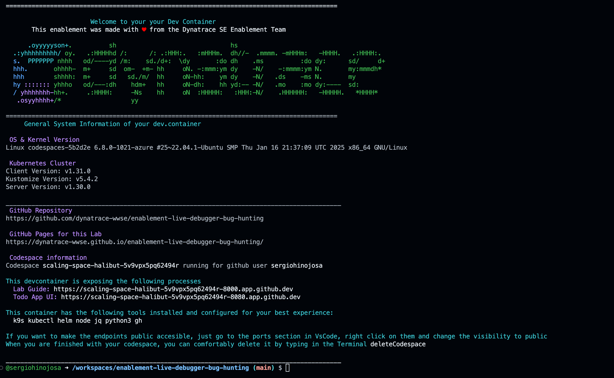

--8<-- "snippets/send-bizevent/3-codespaces.js"

## Create Codespace

Click to open Codespaces for this lab repository:

[](https://codespaces.new/dynatrace-wwse/enablement-dynatrace-log-ingest-101){target="_blank"}

!!! tip "Codespace Configuration"
    - Branch
        - select the **main** branch
    - Dev container configuration
        - select **Enablement on codespaces template**
    - Machine type
        - select **4-core**
    - Region
        - select any region, preferably one closest to your Dynatrace tenant

### Wait for Codespace
We know your time is very valuable. This codespace takes around 7-10 minutes to be fully operational. A local Kubernetes ([kind](https://kind.sigs.k8s.io/){target="_blank"}) cluster monitored by Dynatrace will be configured and in it a sample application, AstroShop, will be deployed. To make your experience best, we are also installing and configuring tools like:

**k9s kubectl helm node jq python3 gh**

## Explore Codespace

Your Codespace has now deployed the following resources:

- A local Kubernetes ([kind](https://kind.sigs.k8s.io/){target="_blank"}) cluster monitored by Dynatrace, with some pre-deployed apps
  that will be used later in the demo.

- After a couple of minutes, you'll see this screen in your codespaces terminal. It contains the links to the local expose labguide and the UI of the application which we will be doing our Hands-On training.

Sample output:


## Tips & Tricks

We want to boost your learning and try to make your experience as smooth as possible with Dynatrace trainings. Your Codespaces have a couple of convenience features added. 

### Show the greeting
In the terminal, there are functions loaded for your convenience. By creating a new Terminal the Greeting will be shown that includes the links to the exposed apps, the Github  pages, the Github Repository, the Dynatrace Tenant that is bound to this devcontainer and some of the tools installed.

You can create a new Terminal directly in VSCode, type `zsh` or call the function `printGreeting` and that will print the greeting with the most relevant information.

### Navigating in your local Kubernetes
The client `kubectl` and `k9s`are configured so you can navigate in your local Kubernetes like butter. 


### Exposing the apps to the public
The AstroShop app is being exposed in the devcontainer to your localhost. If you want to make the endpoints publicly accesible, just go to the ports section, right click on them and change the visibility to public.

## Troubleshooting

### AstroShop

If you encounter problems with the AstroShop app deployed in the `astroshop` namespace, you can easily recycle the pods.

Recycle pods:
```sh
kubectl delete pods --all -n astroshop
```

But before doing so, if you want to see what is happenning we recommend the following: 

Verify all astroshop pods
```sh
kubectl get pods -n astroshop
```

Check for events in the astroshop namespace
```sh
kubectl get events -n astroshop
```

Check for system and cluster events 
```sh
kubectl get events -n kube-system
kubectl get events -n default
```

### App exposure
The Astroshop application is exposed via NodePort and it's mapping port 8080 to Cluster port 30100. Yo can verify it by typing:
```sh
kubectl get svc astroshop-frontendproxy -n astroshop
```

### CronJobs

If you encounter problems with the CronJobs deployed in the `cronjobs` namespace, reapply the manifests.

Deploy cronjobs:
```sh
deployCronJobs
```

## Continue

In the next section, we'll deploy Dynatrace on our Kubernetes cluster to start collecting logs (and more!).

<div class="grid cards" markdown>
- [Continue to Deploy Dynatrace:octicons-arrow-right-24:](4-deploy-dynatrace.md)
</div>
