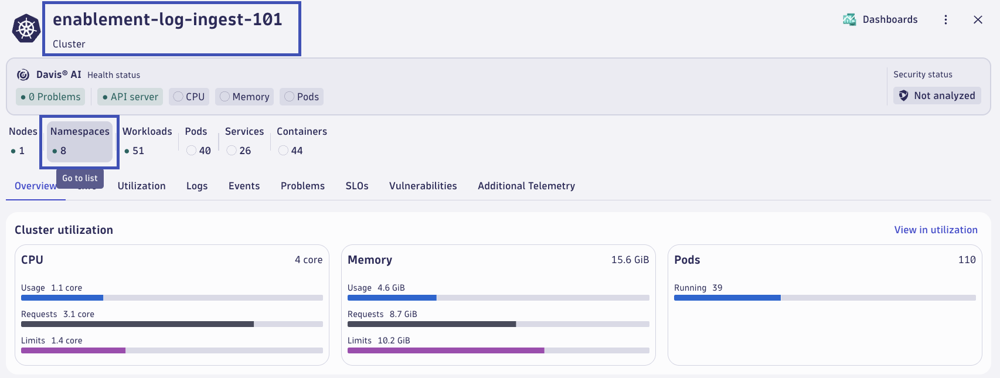
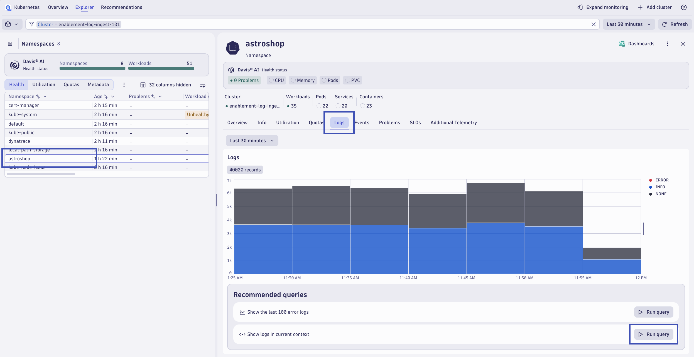
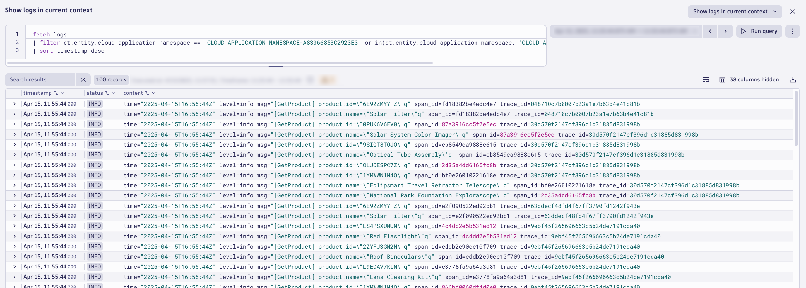

# Deploy Dynatrace
--8<-- "snippets/send-bizevent/4-deploy-dynatrace.js"

Dynatrace provides integrated log management and analytics for your Kubernetes environments by either running the OneAgent Log Module or integrating with log collectors such as Fluent Bit, OpenTelemetry Collector, Logstash, or Fluentd.

Dynatrace provides a flexible approach to Kubernetes observability where you can pick and choose the level of observability you need for your Kubernetes clusters. The Dynatrace Operator manages all the components needed to get the data into Dynatrace for you. This also applies to collecting logs from Kubernetes containers. Depending on the selected observability option, the Dynatrace Operator configures and manages the Log Module to work in conjunction with or without a OneAgent on the node.

<div class="grid cards" markdown>
- [Learn More:octicons-arrow-right-24:](https://docs.dynatrace.com/docs/ingest-from/setup-on-k8s/deployment/k8s-log-monitoring){target="_blank"}
</div>

## Kubernetes Platform Monitoring + Application Observability

Kubernetes platform monitoring sets the foundation for understanding and troubleshooting your Kubernetes clusters. This setup does not include OneAgent or application-level monitoring by default, but it can be combined with other monitoring and injection approaches.

!!! tip "[Kubernetes Platform Monitoring](https://docs.dynatrace.com/docs/ingest-from/setup-on-k8s/how-it-works/kubernetes-monitoring){target="_blank"}: Capabilities"
    - Provides insights into the health and utilization of your Kubernetes clusters, including object relationships (topology)
    - Uses the Kubernetes API and cAdvisor to get node- and container-level metrics and Kubernetes events
    - Enables out-of-the-box alerting and anomaly detection for workloads, Pods, nodes, and clusters

Application observability focuses on monitoring application-level metrics by injecting code modules into application Pods. This mode offers multiple injection strategies (automatic, runtime, and build-time) to collect application-specific metrics. For infrastructure-level insights, combine it with Kubernetes platform monitoring.

!!! tip "[Application Observability](https://docs.dynatrace.com/docs/ingest-from/setup-on-k8s/how-it-works/application-monitoring){target="_blank"}: Capabilities"
    - Dynatrace injects code modules into Pods using the Kubernetes admission controller.
    - Get granular control over the instrumented Pods using namespaces and annotations.
    - Route Pod metrics to different Dynatrace environments within the same Kubernetes cluster.
    - Enable data enrichment for Kubernetes environments.

### Set Environment Variables

Set the environment variable **DT_TENANT** to the Dynatrace SaaS tenant URL.  For example, abc123 for live -> `https://abc123.live.dynatrace.com` or sprint -> `https://abc123.sprint.dynatracelabs.com` *no apps in the URL*

```text
export DT_TENANT=https://abc123.live.dynatrace.com
```

Set the environment variable **DT_OPERATOR_TOKEN** to the Dynatrace API Token value for the Dynatrace Operator.  Dynatrace Operator Token, it will be created automatically when adding a new Cluster over the UI. It contains the following permissions: 'Create ActiveGate tokens' 'Read entities' 'Read settings' 'Write settings' 'Access problem and event feed, metrics and topology' 'PaaS Integration - installer download'

```text
export DT_OPERATOR_TOKEN={your-api-token}
```

Set the environment variable **DT_INGEST_TOKEN** to the Dynatrace API Token value for the Ingest Token.  Dynatrace Ingest Token, it will be created automatically when adding a new Cluster over the UI. It contains the following permissions: 'Ingest logs' 'Ingest metrics' 'Ingest OpenTelemetry traces'

```text
export DT_INGEST_TOKEN={your-api-token}
```

### Deploy Dynatrace on Kubernetes

With your environment variables set, invoke the deployment automation script within the Codespace instance.

```sh
deployDynatraceOnK8s
```


### Refresh Application Pods

Now that Dynatrace is deployed, let's refresh/recycle the application pods for `astroshop` to inject the OneAgent code modules.

```sh
kubectl delete pods -n astroshop --field-selector="status.phase=Running"
```

### Validate Log Ingest

In your Dynatrace tenant, return to the `Kubernetes` app.  From the Cluster overview tab, click on `Namespaces` to open the list of Namespaces on the Cluster.



From the list of Namespaces, click on `astroshop`.  From the Namespace pop-out, click the `Logs` tab.  Verify in the chart that logs are being ingested for the `astroshop` namespace.  Click on `Run query` on the **Show logs in current context** option.



Validate log data after running the query.



## Continue

In the next section, we'll configure Log Monitoring in Dynatrace.

<div class="grid cards" markdown>
- [Continue to configuring Dynatrace Log Monitoring:octicons-arrow-right-24:](5-configure-dynatrace.md)
</div>