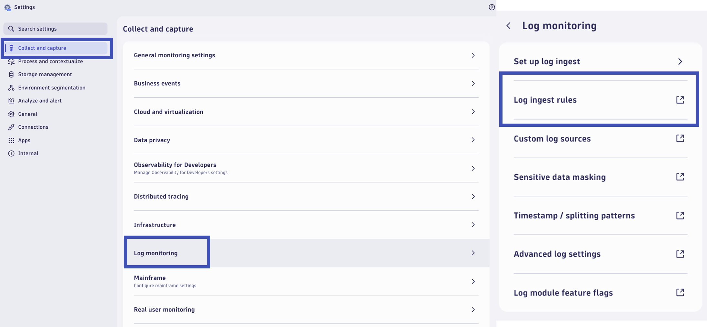
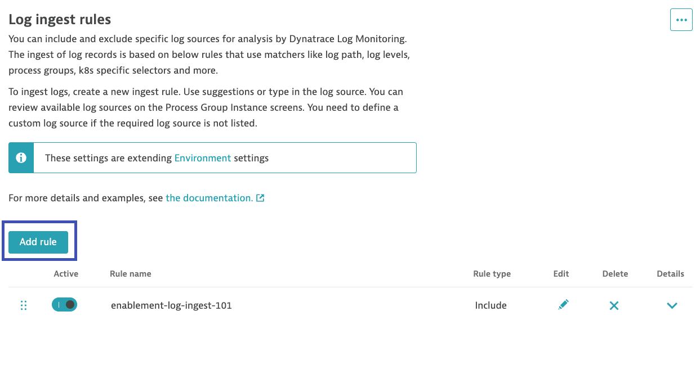
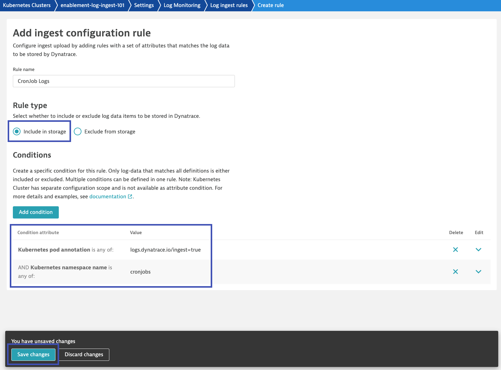

# Configure Dynatrace
--8<-- "snippets/send-bizevent/5-configure-dynatrace.js"

You can configure log ingestion rules in Dynatrace to control which logs should be collected from your Kubernetes environment. The rules leverage Kubernetes metadata and other common log entry attributes to determine which logs are to be ingested. The standard log processing features from OneAgent, including sensitive data masking, timestamp configuration, log boundary definition, and automatic enrichment of log records, are also available for Kubernetes logs.

!!! tip "Dynatrace Automatic Log Ingest"
    Dynatrace automatically discovers and analyzes new log files, including Kubernetes pod logs.  The out-of-the-box configuration will discover, parse, and ingest the logs from our `astroshop` application.  In order to exercise some of the advanced log monitoring configurations, we'll ingest sample CronJobs with logs that will need further configuration.

## Ingest CronJob Logs

Dynatrace log ingest configuration allows you to remotely configure installed OneAgents to either include specific log sources for forwarding to Dynatrace or exclude them from upload. While log discovery refers to the automatic detection of log files so that no additional log source configuration effort is required on your environment, log ingestion involves the process of collecting logs and sending required log sources into Dynatrace.

Log ingest configuration is based on rules that use matchers to target process groups, content, log levels, log paths, and other attributes described in this document. These rules determine which log files are ingested among those automatically detected by OneAgent or defined as custom log sources. 

Log ingest rules are ordered configurations processed from top to bottom. For higher configuration granularity, log ingest rules can be defined at four scopes: host, Kubernetes cluster, host group, and environment, with host scope rules having the highest priority.


### Log Ingest Rule

In your Dynatrace tenant, open the (new) `Settings` app.  Select the `Collect and capture` submenu.  Click on the `Log monitoring` menu.  Click on `Log ingest rules` to open the setting in the `Settings Classic` app.



Here you will find the log ingest rules set at the environment-level.  Rules configured here will be inherited by every host group, Kubernetes cluster, and host in the environment.  However, these settings can be overridden at the granular entity-level.

Click on `Hierarchy and overrides`.  Locate your Kubernetes cluster override for `enablement-log-ingest-101` and click on it.


Add a new rule that will capture logs from specific pods within the `cronjobs` namespace.  Click on `Add rule`.



Configure the rule with the following details:

Rule Name:
```text
CronJob Logs
```

Rule Type:
```text
Include in storage
```

Conditions:

Kubernetes namespace name is
```text
cronjobs
```

Kubernetes pod annotation is
```text
logs.dynatrace.io/ingest=true
```



This rule will enable the Log Module to collect logs from pods that belong to the `cronjobs` namespace **AND** have the annotation `logs.dynatrace.io/ingest: true`.

However, for this use case, configuring this rule alone will not start capturing these logs...

### Log Module Feature Flag

!!! tip "Log Autodiscovery"
    Logs will automatically be discovered by Dynatrace (OneAgent & Log Module).  However, not all logs may be discovered by default.  A log file must meet all of the [autodiscovery requirements](https://docs.dynatrace.com/docs/analyze-explore-automate/logs/lma-log-ingestion/lma-log-ingestion-via-oa/lma-autodiscovery#autodiscoveryrequirements) to be autodiscovered!

An enhancement to the log module for Kubernetes introduces a feature that enables Dynatrace to capture all container logs, even those that do not meet the autodiscovery requirements.  The logs from the CronJobs are written by a container echoing a message to stdout.  This prevents them from meeting the autodiscovery requirements, thus we will need to enable the feature flag to collect all container logs.

In your Dynatrace tenant, return to the Kubernetes settings for your cluster where you configured the log ingest rule.  In the Log Monitoring section, click on `Log module feature flags`.  Enable the setting `Collect all container logs`.  Click on `Save changes`.


With this feature enabled and the log ingest rule configured, Dynatrace will now start to collect logs from the CronJob containers.

### Query CronJob Logs

Validate that the logs are now being ingested into Dynatrace.  Open the `Logs` app.  Filter the logs on the `cronjobs` namespace and click `Run query`.

```text
k8s.namespace.name = cronjobs
```


## Configure Sensitive Data Masking

Specific log messages may include user names, email addresses, URL parameters, and other information that you may not want to disclose. Log Monitoring features the ability to mask any information by modifying the configuration file on each OneAgent that handles information you consider to be sensitive.

Masking is performed directly on OneAgent, ensuring that sensitive data are never ingested into the system.

Within our CronJob logs, the `log-message-cronjob` writes out a message containing an email address.  While this email address isn't real, we can use it as an example of sensitive data masking.

```log
$TIMESTAMP INFO Log message from cronjob.  email=example@dynatrace.io Ending job.
```

### Sensitive Data Masking Rule

In your Dynatrace tenant, return to the Kubernetes settings for your cluster where you configured the log ingest rule.  In the Log Monitoring section, click on `Sensitive data masking`.  Click on `Add rule`.


Configure the rule with the following details:

Rule Name:
```text
CronJob Email Address
```

Search Expression:
```javascript
\b[\w\-\._]+?@[\w\-\._]+?\.\w{2,10}?\b
```

Masking Type:
```text
SHA-256
```

Conditions:

Kubernetes namespace name is
```text
cronjobs
```


The advantage of using the SHA-256 masking type is that every unique value (email address) will produce a unique hash value.  This may enable you to see if the log contains the same email address or different email addresses.  However, you will obviously not be able to decrypt what that email address is, keeping it secure!

!!! tip "Built In Sensitive Data Masking"
    Dynatrace includes built-in sensitive data masking rules for email address, credit cards, URL queries, IBAN, and API-Tokens at the Environment-level.  If these settings are enabled, that may have already caused the email address in the CronJob log to be masked.
    

### Query CronJob Logs

The CronJob will execute every few minutes.  Allow some time for the job to run again and produce new log records.

Return to the `Logs` app and filter on the logs that contain the email address.

```text
k8s.namespace.name = cronjobs k8s.deployment.name = log-message-cronjob-* content = "*email*"
```


The logs now contain the hashed value of the email address, `03cb5558c834be3796387a17763f315f22d3ab87cd1dc6d5d4817f8d27ec5913`.

## Configure Timestamp/Splitting Patterns

By default, log monitoring automatically detects only the most common and unambiguous subset of date formats supported. Each time a timestamp pattern is detected, the line will be treated as the beginning of the log entry. All following lines without a detected timestamp will be treated as a continuation and reported as a single multi-line log record.

In the event that a multi-line log record contains another supported timestamp, it is likely that Dynatrace will treat that line as a new log record.  If this is not the desired result, a timestamp configuration rule can be created to change this behavior.

In our CronJob logs, the `timestamp-cronjob` writes a multi-line log record that contains multiple timestamps.  Dynatrace treats the extra timestamps as new log lines.  We want this log record to be treated as a single record.

Record 1:
```log
$TIMESTAMP INFO BatchJob JOB_NAME=AddBanks , JOB_BODY={ 
   "id" : "xxxxxx", 
   "name": { 
     "first": "TEST" 
   }, 
   "email": "xxxxxxxxxxxxx", 
   "registrationStatus": "Log Record Line Break Expected!", 
```

Record 2:
```log
   "registrationDate": " $TIMESTAMP ", 
   "termsConditions": false, 
   "customerLevelCode": "XXX", 
   "nameMatchIndicator": false, 
   "complianceData": { 
     "verifications": [ 
       { 
         "channelType": "1" 
       } 
     ], 
     "cuba": false, 
     "isDocReceived": false 
   }, 
   "loyaltyDetails": { 
     "Log record line break expected": { 
```

Record 3:
```log
       "cardEnrolledDate": " $TIMESTAMP ", 
       "enrollmentType": "EXPLICIT", 
       "cardStatus": "INACTIVE", 
     } 
   } 
 } 
 END OF JOB_BODY 
 host = 7a145cace01782517c351e02a9b217041767431359c6ab9f9cb175b270eaf598
 ```

### Timestamp Configuration Rule

In your Dynatrace tenant, return to the Kubernetes settings for your cluster where you configured the log ingest rule.  In the Log Monitoring section, click on `Timestamp/Splitting patterns `.  Click on `Add rule`.


Configure the rule with the following details:

Rule Name:
```text
Timestamp CronJob
```

Search Expression:
```javascript
%^%FT%T%z
```

Conditions:

Kubernetes namespace name is
```text
cronjobs
```


Here is a breakdown of our pattern:

| Entry | Description |
|-------|-------------|
| %^    | Matches timestamp patterns only at the start of a log line |
| %F    | Shortcut for %Y-%m-%d, 2025-11-30 for example              |
| T     | The literal character 'T' as found in the ISO 8601  format |
| %T    | Shortcut for %H-%M-%S, 12:30:01 for example                |
| %z    | Timezone indicator as found in the ISO 8601 format         |

This rule will cause Dynatrace to stop splitting log records on new lines with timestamps, since they don't appear at the beginning of the log record.

### Query Logs

The CronJob will execute every few minutes.  Allow some time for the job to run again and produce new log records.

Return to the `Logs` app and filter on the logs that contain the multiple timestamps.

```text
k8s.namespace.name = cronjobs content != "*injection-startup*" k8s.workload.name="timestamp-cronjob"
```


Each log message is now treated as a single, multi-line, log record containing the entire message.

## Ingest Dynatrace Logs

In some cases, you may want to collect container logs from the Dynatrace components running in the `dynatrace` namespace.  By default, collection of these logs is disabled, even if you have a log ingest rule configured to do so.  Logs collected from the Dynatrace components are treated like any other log that you ingest - it consumes licensing, storage, etc.

In your Dynatrace tenant, return to the Kubernetes settings for your cluster where you configured the log ingest rule.  In the Log Monitoring section, click on `Advanced log settings`.  Enable the setting `Allow OneAgent to monitor Dynatrace logs`.  Click on `Save changes`.


This allows the Log Module to discover the Dynatrace component logs.  However, we need to add an ingest rule to ship them to Dynatrace.

In the Log Monitoring section, click on `Log ingest rules`.  Modify your existing rule called `enablement-log-ingest-101` and add the `dynatrace` namespace to the matcher.  Save your changes.


### Query Logs

Return to the `Logs` app and filter on the logs from the `dynatrace` namespace.

```text
k8s.namespace.name = dynatrace
```


These logs can help with troubleshooting any observability issues on the Kubernetes cluster.  However, it is the log module that is collecting these logs, so if the log module is not working - the logs won't be shipped to Dynatrace!

## Continue

In the next section, we'll query, view, and analyze logs ingested into Dynatrace.

<div class="grid cards" markdown>
- [Continue to analyzing logs in Dynatrace:octicons-arrow-right-24:](6-analyze-logs.md)
</div>